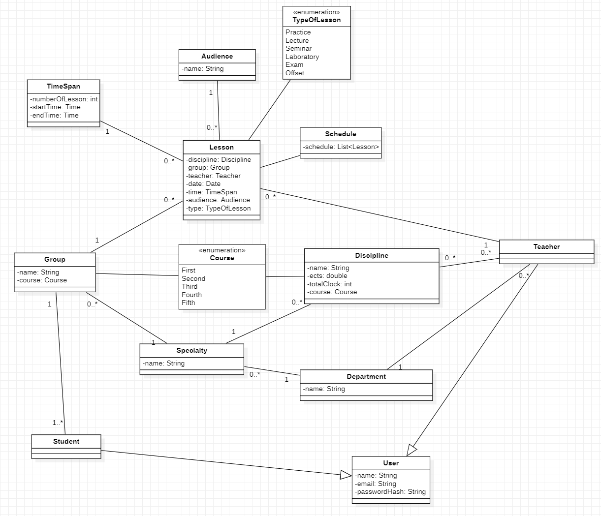

# UNIVERSITY-CMS

## ***Teacher :***

### Given user is logged on as Teacher

- User can navigate to `Disciplines` where can see all disciplines in university.
- User can navigate to `My disciplines` where can see all disciplines belong user.
- User can navigate to `Departments` where can see all departments in university.
- User can navigate to `Groups` where can see all groups in university.
- User can navigate to `Specialty` where can see all specialties in university.

- User can see and navigate to `My Schedule` menu
- User should see own Teacher schedule according to selected date/range filter
- User can see own Department schedule with all teachers with selected date/range filter
- User can see own Department schedule with all teachers with selected date/range filter

## ***Student :***

### Given user is logged on as Student

- User can see and navigate to `My Schedule` menu.
    - User should see own Student schedule according to selected date/range filter.
- User can navigate to `My disciplines` where can see all disciplines belong user.
- User can navigate to `Teacher schedule` with selected teacher and date/range filter.
- User can see `Study plan` where can see all disciplines with selected department,
  specialty, course.

## ***All users can :***

- User can navigate to `Audiences` where can see all audiences in university.
- User can navigate to `Timetable` where can see timetable in university.
- User can navigate to `Free audiences` with selected date and time of lection filter.
- User can navigate to `Schedule` with selected group and date/range filter.
- User can navigate to `Audience schedule` with selected audience,date and time of lection filter.

# ***Staff :***

### Given user is logged on as Staff:

- User can see all possible schedules.
- User can change any information except admin panel.

# ***Admin :***

### Given user is logged on as Admin:

- User have all privileges like a __Staff__.
- User can navigate to `Admin panel`.
    - User can navigate to `Roles editing` where user can edit privileges in roles, delete (except __Admin__ role) and
      create roles.
    - User can navigate to `Users editing` where user can edit,delete and create users.

#### Logins and passwords for app: ####

- Admin: admin@example.com admin
- Staff: staff@example.com staff
- User with role teacher: fakeTeacher@example.com teacher
- User with role student: fakeStudent@example.com student
- Teacher: teacher@example.com teacher
- Student: student@example.com student

# Class diagram of UNIVERSITY CMS

# How to run application:

## 1 variant:

1. Copy project on your device.
2. Open terminal in docker folder.
3. Enter in terminal `docker-compose up -d` - we start app db.
4. Run application.
5. Application ready to use on localhost:8080

## 2 variant:

1. Copy project on your device.
2. Run mvn package.
3. Open terminal in project folder.
4. Run `docker-compose --env-file docker/.my-env up -d` command.
5. Application ready to use on localhost:8080

